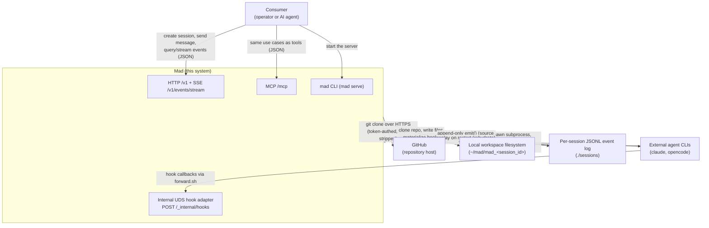

# System Context

This is a C4 level-1 (system context) view of Mad: who calls it, what it
calls, and the data that crosses each edge. Mad sits in the middle as a
self-hosted infrastructure layer; everything else is an external actor or
system it integrates with. Mad's core is infrastructure — it provisions an
isolated workspace, clones a repo, launches an external coding agent against
it, and streams that agent's stdout as events (hard rule 1); orchestration of
several sessions toward one goal is a shipped layer built on top of that core.

## Context diagram

## Upstream — who calls Mad

### The consumer (operator or AI agent)

The single upstream caller is whoever drives Mad: a human operator with curl
or a script, or an autonomous AI agent. There is no multi-tenancy and no
in-process auth — authentication is expected to happen at the edge (e.g. a
Cloudflare Tunnel with Service-Token Access; see `docs/05-operations/runbooks/cloudflare-tunnel.md`).
The consumer reaches Mad over three request/response surfaces, all backed by
the **same use cases**:

- **HTTP `/v1`** — strongly-typed JSON routes for sessions, events,
  orchestration, and providers (`src/mad/adapters/inbound/http/app.py`;
  bodies/responses are Pydantic models, hard rule 9). The same surface exposes
  the streaming SSE endpoint `GET /v1/events/stream`.
- **MCP `/mcp`** — a Streamable-HTTP MCP app mounted in the same process
  (ADR-0010). Every non-streaming `/v1` route has a mirrored MCP tool that
  calls the same use case in-process and returns the same model (hard rule 13,
  ADR-0012). In practice MCP is used more than raw HTTP.
- **CLI `mad serve`** — the console script that boots the server
  (`src/mad/entry_points/cli.py`). It starts Mad; it is not itself a remote
  caller.

Flows in: `POST /v1/sessions` (create a session + resource list),
`POST /v1/sessions/{id}/messages` (send the prompt that launches the agent),
and reads via `GET /v1/events` (historical replay) and `GET /v1/events/stream`
(live SSE, `Last-Event-ID`-resumable per ADR-0005).

### GitHub (repository host)

When a session declares a `github_repository` resource, Mad clones it from
GitHub over HTTPS. For private repos the consumer passes an
`authorization_token` on the resource; Mad injects it into the clone URL once,
then immediately runs `git remote set-url origin <url-without-token>` to strip
it (`local_workspace_provisioner.py`, lines 86-99). The token is never
persisted to the workspace, the session log, or stdout (hard rule 2). GitHub
is upstream in the sense that its repository content flows into Mad's
workspace.

## Downstream — what Mad calls

### External agent CLIs (claude, opencode)

For each launched session Mad spawns an external agent CLI as a subprocess
with `cwd` set to the effective working directory (the cloned repo path for a
single-github-mount session, per ADR-0011). It passes the prompt and exports
`MAD_SESSION_ID`, `MAD_HOOK_SOCKET`, and `MAD_PROVIDER` into the subprocess
environment. Mad reads the agent's stdout line-by-line and re-emits each line
as an `agent.output` event, then emits `session.status_idle` on exit 0 or
`session.error` on non-zero exit / timeout (`claude_cli.py`, `opencode.py`).
Mad never parses tool calls or runs an agent loop — the agent brings its own
harness (hard rule 1). Production providers are `claude_cli`
(`claude --dangerously-skip-permissions`, binary via `MAD_CLAUDE_CLI_BIN`) and
`opencode` (`opencode run`, binary via `MAD_OPENCODE_BIN`), dispatched by
`factory.get_launcher`.

### Local workspace filesystem

Each session gets an isolated workspace directory under `~/mad`
(`mad_<session_id>`), overridable with `MAD_WORKSPACE_DIR`
(`local_workspace_provisioner.py`). Mad clones repos into it, writes literal
`file` resources at their `mount_path`, and materializes the `forward.sh` hook
and `settings.local.json` for the agent. `mount_path` values are mapped to
subdirectories of the workspace and absolute paths that would escape it are
rejected (hard rule 3). The workspace is the agent's sandbox; the agent reads
and writes here as it works.

### Per-session JSONL event log

Every event is appended to an append-only per-session JSONL file under
`./sessions` (overridable with `MAD_SESSIONS_DIR`). This log is the source of
truth (hard rule 6): if the process crashes, a new run replays the log to
rebuild live state (the lifespan in `app.py` bootstraps the projection and
rehydrates pending sessions on startup). The only write path is
`EventEmitter.emit()` (hard rule 11). Logs are kept forever unless
`MAD_SESSIONS_RETENTION_DAYS` enables a TTL purge at startup.

### Internal UDS hook channel

A separate internal FastAPI app, bound to a Unix domain socket, accepts hook
callbacks at `POST /_internal/hooks` (`src/mad/adapters/inbound/internal/`,
ADR-0008). The `forward.sh` script materialized into each workspace posts the
agent CLI's lifecycle hooks to this socket (path in `MAD_HOOK_SOCKET`). The
internal app shares the same `EventEmitter` instance, so hook events
(`agent.<provider>.hook.*`) appear on `GET /v1/events/stream` automatically.
This channel is internal-only and not exposed to upstream consumers.

## Boundaries (what is out of scope here)

Mad deliberately does not own: the agent's reasoning/tool loop (the external
CLI does) or authentication (the edge does). It *does* chain several sessions
toward one goal — the `WorkflowCoordinator` in `core/orchestration/` does this
today (see the workflows user manual). What remains deferred is a tenant model
(ADR-0006), not orchestration.
This page describes Mad's external boundary only; the internal hexagonal layout
(core bounded contexts and adapters) is covered in the architecture section.
