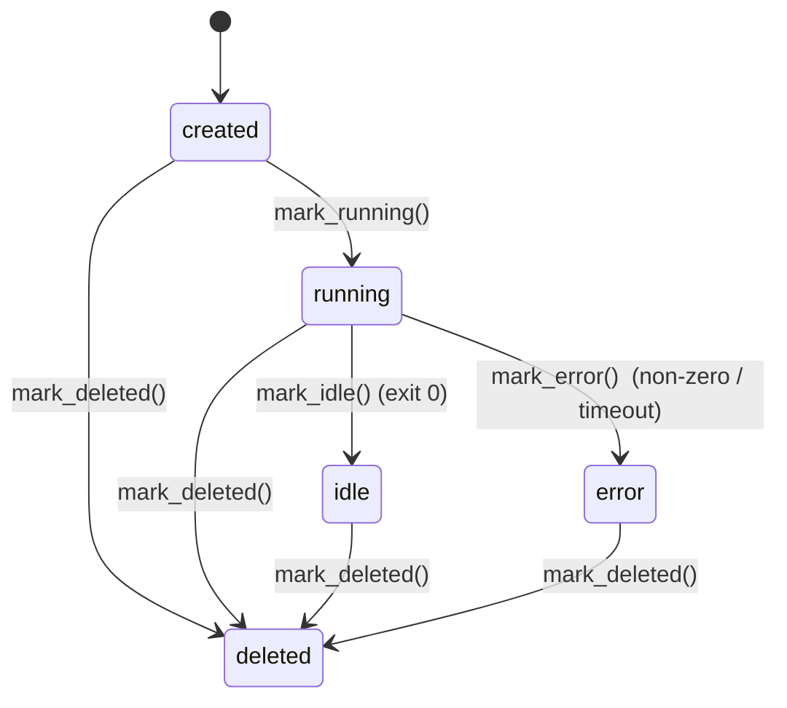

# Domain

The entities and business rules this service owns (Session, Event, Task,
Workflow, MountPath and the orchestration policies) — not the on-disk
persistence layout,
which is [`../02-architecture/data-model.md`](../02-architecture/data-model.md).

This page describes the *what* and the *invariants*. It is sourced from the
three framework-free bounded contexts under `src/mad/core/`:

- `sessions/domain/` — the `Session` entity, the `MountPath` value object,
  rehydration, and session exceptions.
- `events/domain/` — the `Event` record and UUIDv7 `event_id` minting.
- `orchestration/domain/` — the `Task` and `Workflow` entities and the
  dispatch / model / effort / timeout / priority policies.

None of these modules import a framework, `subprocess`, or `mad.adapters` —
the boundary is enforced by import-linter (hard rule 4). Storage shapes, JSONL
record layout, and persistence mechanics live in the data-model doc linked
above; this page deliberately stays at the concept level.

## Load-bearing invariants

These hold across every concept on this page:

- **Infrastructure only (hard rule 1).** The domain models *sessions of an
  external agent*, never the agent's reasoning. Mad launches an external agent,
  streams its stdout as `agent.output`, and reports completion. It NEVER parses
  tool calls, executes tools, or runs a conversation loop. Concretely, a
  `Task`'s `content` is *opaque* — the orchestration module never inspects it
  (see `task.py`, `ordering.py`).
- **The event log is the source of truth (hard rule 6).** Domain entities are
  projections of an append-only event stream. `Session` and `Task` carry no
  authoritative state of their own; the log does. A `Session` can be rebuilt
  from scratch by replaying its events — see `rehydrate.py`
  (`rehydrate_from_events`).
- **One write path (hard rule 11).** Every state change is an event written
  through `EventEmitter.emit()`. The domain defines the vocabulary and the
  transition rules; it does not write.
- **Path-traversal safety (hard rule 3).** Any externally supplied mount path
  is wrapped in a `MountPath` value object that rejects escapes before any
  filesystem use.

## Session

Source: `src/mad/core/sessions/domain/entities/session.py`.

The `Session` is the primary aggregate root — it tracks one external-agent
invocation from creation through running, idle, error, or deletion. It is a
mutable dataclass; identity is `session_id`.

### Lifecycle / status

`status` is a string with a fixed transition graph:

```
created ──▶ running ──▶ idle
                   └──▶ error
   any ───────────────▶ deleted
```



Transitions are explicit methods (`mark_running`, `mark_idle`, `mark_error`,
`mark_deleted`). `idle` corresponds to launcher exit 0; `error` to a non-zero
exit or a timeout (the `AgentLauncher` contract in `CLAUDE.md`). `deleted` is
reachable from any state.

### Rules and notable fields

- **`working_directory` defaults to `workspace`.** `__post_init__` fills an
  empty `working_directory` with `workspace`, so a session always has a
  concrete effective cwd (ADR-0011).
- **`updated_at` is monotonic under replay.** `touch(timestamp)` only advances
  `updated_at` forward; an out-of-order or replayed older event never pulls the
  timestamp backwards. `created_at` and `updated_at` are aligned when the caller
  leaves `updated_at` at its sentinel, so they do not differ by stray
  microseconds.
- **Token hygiene (hard rule 2).** `tokens_to_redact` is held for scrubbing and
  is excluded from `repr`; it is never serialized by `to_dict`.
- **Effective-config fields.** `model`, `effort`, `timeout_s`,
  `dispatch_policy`, and `priority` are per-session overrides that feed the
  orchestration resolvers below. `None` (or `DEFAULT_PRIORITY`) means "no
  override — inherit the next level down".
- **Priority.** `priority` is bounded to `[1, 10]` and defaults to `1` (lowest)
  so an explicitly prioritized session always outranks an unprioritized one
  (see `ordering.py`).

### Rehydration

`rehydrate_from_events(session_id, events)` (in `rehydrate.py`) rebuilds a
`Session` purely from its persisted event stream — no I/O, no ports. It folds
the vocabulary into state: `session.created` seeds the agent/config fields and
`created_at`; `session.status_*` and `session.deleted` drive `status`;
`dispatch_policy.updated` / `dispatch_policy.cleared` rebuild the per-session
policy; `dispatch_priority.updated` rebuilds `priority`. Malformed policy or
priority payloads are skipped rather than crashing the replay. This is the
concrete expression of hard rule 6: the log, not the in-memory index, is
authoritative.

## Event

Source: `src/mad/core/events/domain/event.py`, `event_id.py`.

An `Event` is Mad's unit of record — a single immutable observation in the
persisted log. It is a frozen dataclass: `event_id`, `session_id`, `type`,
`data`, `timestamp`.

### Rules

- **Vocabulary is verbatim and open (ADR-0004).** `type` is a free-form string
  on purpose, so new vocabulary can be added without changing the entity. The
  events module accepts and emits Mad's vocabulary as-is — it does not
  translate, classify, dispatch, or act on events (hard rule 8).
- **`event_id` is a sortable UUIDv7 (ADR-0005).** `new_event_id()` mints an
  RFC 9562 UUIDv7 whose first 48 bits are the Unix-millisecond mint time, so
  ids are lexicographically sortable across processes. This is what powers
  `Last-Event-ID` catch-up on the SSE surface.
- **Backward tolerance.** `event_id` may be `None` for events written before
  UUIDv7 minting existed; `event_from_persisted` tolerates legacy lines with no
  `event_id` (yields `None`) and no `timestamp` (defaults to the Unix epoch so
  they sort first).

### Representative vocabulary

The vocabulary is not enumerated in the domain (it is free-form), but the
recurring types it folds over include:

| Type | Meaning |
|---|---|
| `session.created` | A session was provisioned (carries agent, config). |
| `user.message` | A prompt was sent to the session. |
| `session.status_running` | The launcher started the agent. |
| `agent.output` | One line of the agent's stdout. |
| `session.status_idle` | The agent exited 0. |
| `session.error` | Non-zero exit or timeout (stderr scrubbed). |
| `session.deleted` | The session was deleted. |
| `dispatch_policy.updated` / `.cleared` | Per-session dispatch policy set / removed. |
| `dispatch_priority.updated` | Per-session priority changed. |
| `task.queued` / `.dispatched` / `.completed` / `.cancelled` / `.failed` | Task state history. |
| `agent.conversation_started` / `.conversation_resume_skipped` | Conversation-id tracking. |
| `agent.<provider>.hook.*` | claude-cli hook ingestion (ADR-0008). |

## Task

Source: `src/mad/core/orchestration/domain/task.py`.

A `Task` is the orchestration unit — a piece of work submitted via
`POST /v1/sessions/{id}/tasks`. It is a frozen dataclass: `task_id`,
`session_id`, `content`, `scheduled_for`, `created_at`, plus optional `model`,
`effort`, and `conversation_mode` (`"new"` | `"resume"`).

### Rules

- **`content` is opaque (ADR-0009 Decision 7 / hard rule 1).** The
  orchestration module never inspects it; the launcher receives it verbatim
  when the task is dispatched.
- **State lives in the log, not the entity (ADR-0009 Decision 3).** A `Task`
  carries no status field. A live projection places it in a per-session
  `queued` list or as the single `in_flight` slot; terminal tasks (completed /
  cancelled / failed) leave the projection. The authoritative state history is
  the event stream `task.queued` → `task.dispatched` →
  `task.{completed,cancelled,failed}`.
- **`scheduled_for` is recorded, not yet acted on (v1).** It is a free-form
  string — `"now"`, `"next_window"`, or an ISO 8601 timestamp. The HTTP layer
  validates the shape; the domain stores it verbatim. v1 has no scheduling
  behaviour beyond recording, so adding it later is purely additive.
- **Cross-session ordering (`ordering.py`, ADR-0009 §10).**
  `order_ready_candidates` is the single pure function deciding which queued
  task dispatches next across sessions, ranking by
  `(-priority, head_task.created_at, session_id)`: priority descending, then
  the head task's arrival time ascending, then `session_id` as a deterministic
  tiebreak. Within a session, order is FIFO. Both the dispatcher and the
  operator-facing `GET /v1/queue` go through this one function so the queue view
  never disagrees with what dispatches.

### Task-related exceptions

From `orchestration/domain/exceptions/`:

- `TaskNotFound` — unknown `task_id` on the session (HTTP 404).
- `TaskAlreadyDispatched` — cancel attempted on an in-flight task; v1 cannot
  cancel a running task (HTTP 409, ADR-0009 Decision 6).
- `SessionHasInFlightTask` — `/messages` called while a queued task is
  dispatched; the queue dispatcher and `/messages` are mutually exclusive on a
  session (HTTP 409, ADR-0009 Decision 6).

## Workflow

Source: `src/mad/core/orchestration/domain/workflow.py`.

A `Workflow` is a validated DAG of `WorkflowStep`s — the domain concept behind
`POST /v1/workflows` for chaining sessions (ADR-0013). It is a frozen
dataclass: `workflow_id`, `steps`, `created_at`, plus a derived `step_index`.
Like `Task`, it holds no status of its own; the graph round-trips through the
`workflow.created` event payload so it survives a restart via replay (hard rule
6), and per-step status is *derived* from the `task.*` history
(`derive_step_status` / `derive_workflow_status` live in this module).

A `WorkflowStep` is one node in the graph: a single Mad session plus one opaque
task. "The step completed" is exactly that task's `task.completed`. Its fields
are `step_id`, `agent`, `prompt`, `mounts`, `depends_on` (predecessor step
ids), `base_branch`, `working_directory`, and the per-session `model`,
`effort`, and `timeout_s` overrides — the same knobs as `POST /v1/sessions`. A
step with an empty `depends_on` is a root; otherwise its task is held unqueued
until every step named in `depends_on` has completed.

A `WorkflowMount` is one mount inside a step's session: a `github_repository`
(declared explicitly by `url`, or inherited `from_step` a predecessor) or an
inline `file` (carrying `content`). A `from_step` mount is the only handoff
between steps, and it is a git ref only — it re-mounts a predecessor's
repository at `ref="sha"` (default, pinning that step's immutable head commit)
or `ref="branch"` (tracking its branch tip). Nothing else crosses the step
boundary.

### Rules

- **The graph is validated at creation (`validate_workflow`, ADR-0013).** A
  workflow must declare at least one step; every `step_id` must be a non-empty,
  unique string; every `depends_on` entry must name a known step and may not be
  the step itself; and the dependency edges may not form a cycle. Any violation
  raises `InvalidWorkflow` (a `ValueError` → HTTP 422) — malformed graphs are
  rejected loudly, never silently accepted.
- **`from_step` inheritance is checked against the dependency edges.** A
  `from_step` mount may only reference a step listed in that step's
  `depends_on`, that referenced step must expose a `github_repository` mount,
  and its `ref` / `type` must be recognised values. This keeps the git handoff
  consistent with the declared DAG.
- **State lives in the log, not the entity.** The `Workflow` is immutable after
  construction and carries no live progress; the authoritative history is the
  `workflow.created` event plus the `task.*` events of its steps, which the
  workflow projection folds into pending / running / completed / failed
  per-step status.

## MountPath

Source: `src/mad/core/sessions/domain/value_objects/mount_path.py`.

A `MountPath` is a frozen value object wrapping a single rule: a request-supplied
absolute path MUST resolve inside `/workspace`. This is the domain enforcement
of hard rule 3 (path-traversal prevention).

### Rules

- Validation runs in `__post_init__`, so an invalid path can never be
  represented — construction raises `PathTraversalError` (a `DomainError`)
  before any filesystem operation.
- The path must be absolute (start with `/`).
- `..` segments are resolved against a logical stack; if they would pop above
  the root, or the resolved logical path is not `/workspace` (or a child of
  it), construction fails with reason `"escapes workspace"`.
- This is the canonical implementation; adapter-side `validate_mount_path`
  delegates here so there is one definition of "safe path".

## Orchestration policies

Source: `src/mad/core/orchestration/domain/`. These are pure value objects and
pure resolver functions — the rules that govern *when* a task dispatches and
*with what* model/effort/timeout. There is no first-class `Workspace` entity
(multi-tenancy is deferred, ADR-0006); "deployment-wide" means one default for
the whole Mad instance, held in a mutable process-global singleton and
persisted under a reserved session log so it survives restart (hard rule 6).

### Dispatch policy (`dispatch_policy.py`, issue #33 / ADR-0009 §9)

Three policies decide whether a queued task may reach the launcher at a given
instant:

- `ImmediatePolicy` — default; dispatch as soon as the queue has work.
- `WorkWindowPolicy` — dispatch only when the wall clock is inside one of its
  `Window`s. A `Window` is an HH:MM start/end in an IANA timezone with an
  optional weekday filter, and may wrap midnight.
- `ManualPolicy` — the queue accumulates indefinitely; only an explicit trigger
  (`manual_drain_remaining > 0`) drains it.

`can_dispatch(policy, now, manual_drain_remaining=...)` is the single predicate;
`next_window_opening(...)` answers "when does the next window open?" by walking
forward in one-minute steps over a bounded horizon. Malformed policy input
raises `InvalidDispatchPolicy` (a `ValueError` → HTTP 422).

### Deployment-default dispatch policy (`deployment_policy.py`, issue #45)

`resolve_effective_policy(session, deployment)` defines the precedence for
*whether-to-dispatch*:

```
effective = session.dispatch_policy
            or deployment.default
            or ImmediatePolicy()
```

### Model / effort / timeout precedence

These three resolvers share the same "most specific wins, else omit / default"
shape but differ in how many levels they have:

| Resolver | Source | Precedence |
|---|---|---|
| Model | `model_config.py` (issue #55) | `task` > `session` > `deployment` > `machine_default` > `None` (omit `--model`) |
| Effort | `effort_config.py` (issue #60) | `session` > `deployment` > `None` (omit the effort flag) — deliberately *no* task level |
| Timeout | `timeout_config.py` (issue #61) | `session.timeout_s` > `MAD_AGENT_TIMEOUT_S` env > `600 s` — always a concrete float, never omitted |

`None` for model and effort is meaningful: it means "impose no opinion, let the
provider pick its own default". Timeout has no "omit" sentinel — every launcher
run gets a concrete wall-clock budget.

### Cross-session priority (`ordering.py`, issue #46)

Priority is bounded `[1, 10]` with `DEFAULT_PRIORITY = 1`. `validate_priority`
raises `InvalidPriority` (a `ValueError` → HTTP 422) on an out-of-range or
non-int value — values are rejected loudly, never clamped silently. The bounds
live here so the `Session` entity, the HTTP boundary, and the replay path share
one definition.

### Rate-limit retry (`retry_schedule.py`, issue #62; `exceptions/rate_limit.py`)

When an external agent exits because the provider is rate-limited, a launcher
raises `RateLimitError` (carrying any captured conversation id, the reason, and
an optional `retry_after_floor_s`) instead of emitting `session.error`. The
dispatcher then drives an exponential-backoff schedule: base 30 s, doubling,
capped at 1 h per interval, with ±10 % jitter, up to a cumulative 5 h ceiling —
after which the task is failed with `reason: "rate_limit_exhausted"`.
`backoff_s(attempt)` and `exceeds_ceiling(cumulative_s)` are the two pure
helpers; the `resetsAt`-derived `retry_after_floor_s` acts as a floor so a
multi-hour session limit is not retried into the ground every 30 s.

## See also

- [`../02-architecture/data-model.md`](../02-architecture/data-model.md) — the
  on-disk persistence layout (the JSONL record shapes these concepts serialize
  to). This page intentionally does not cover storage format.
- `docs/adr/0004-events-module-vocabulary-and-scope.md` — events vocabulary and
  scope.
- `docs/adr/0005-uuidv7-event-id.md` — UUIDv7 `event_id`.
- `docs/adr/0006-multi-tenancy-deferred.md` — why there is no `Workspace`
  entity.
- `docs/adr/0011-launcher-working-directory.md` — `working_directory`
  derivation.
