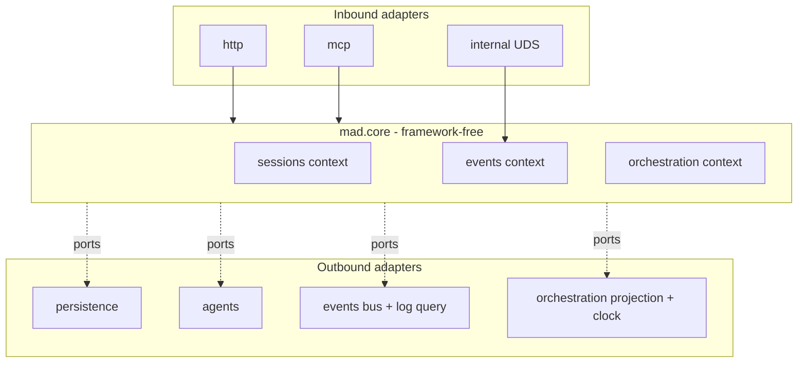

# Components

Internal modules and their responsibilities / boundaries: the core bounded
contexts (sessions, events, orchestration) and the inbound/outbound adapter
groups, plus the ports between them.

Mad is a hexagonal (ports-and-adapters) application. Source lives under
`src/mad/` and splits cleanly in two:

- `src/mad/core/` — framework-free application core. The three primary bounded
  contexts (sessions, events, orchestration) each split into `domain/` (entities,
  value objects, exceptions), `ports/` (Protocol interfaces), and `use_cases/`
  (application logic), plus a thin `config` context (a framework-free settings
  module + a single read use case, #97). No FastAPI, no `subprocess`, no
  `mad.adapters` imports (hard rule 4).
- `src/mad/adapters/` — all I/O. `inbound/` adapters drive the core
  (`http`, `mcp`, `internal`); `outbound/` adapters implement the core's ports
  (`persistence`, `agents`, `events`, `orchestration`).

The composition root is `src/mad/adapters/inbound/http/dependencies.py`
(`build_dependencies`); `create_app(...)` in
`src/mad/adapters/inbound/http/app.py` wires everything with injectable
defaults so tests can substitute fakes.



## Core bounded contexts (`src/mad/core/`)

### sessions — `src/mad/core/sessions/`

The primary bounded context: the lifecycle of a single agent invocation.

| Module | Path | Responsibility / boundary |
|---|---|---|
| `Session` entity | `domain/entities/session.py` | Mutable aggregate root. Status machine `created → running → idle/error`, `any → deleted`; carries model/effort/timeout/priority/dispatch-policy/auto-sync and `last_conversation_id`. Pure data + transitions, no I/O. |
| `MountPath` value object | `domain/value_objects/mount_path.py` | Validated `/workspace`-rooted path; raises `PathTraversalError` on construction (hard rule 3). |
| Domain exceptions | `domain/exceptions/base.py` | `DomainError`, `PathTraversalError`, `SessionNotFound`. |
| `rehydrate` | `domain/rehydrate.py` | Rebuild a `Session` from its persisted JSONL event log (hard rule 6). |
| Outbound ports | `ports/outbound/` | `SessionRepository`, `WorkspaceProvisioner`, `AgentLauncher` Protocols (see Ports below). |
| Use cases | `use_cases/` | `create_session`, `send_user_message`, `get_session`, `list_sessions`, `delete_session`, `cleanup_sessions`, `auto_sync_prompt`. Application logic; receive ports + `EventEmitter` by injection. |
| `SessionStore` | `store.py` | In-memory live-session index (`sessions: dict[str, Session]`, `idempotency: dict[str, str]`). Thin container, no I/O; injected into `create_app()` for per-process isolation. |

Note: `send_user_message._run_launcher` is the shared launcher-driving helper
that the orchestration `Dispatcher` also calls (a documented tactical import).

### events — `src/mad/core/events/`

Observability only: exposes Mad's event vocabulary verbatim over a
cross-session surface. It does not translate, classify, dispatch, or act on
events (hard rule 8, ADR-0004).

| Module | Path | Responsibility / boundary |
|---|---|---|
| `Event` entity | `domain/event.py` | Frozen record `(event_id, session_id, type, data, timestamp)`; `type` is free-form so new vocabulary needs no entity change. `event_from_persisted` adapts the JSONL dict shape. |
| `event_id` | `domain/event_id.py` | UUIDv7 minting for `Last-Event-ID` catch-up (ADR-0005). |
| `EventEmitter` | `emitter.py` | The single write gateway (hard rule 11, ADR-0007): `emit()` appends via `EventStore` then publishes via `EventBus`, plus an optional `on_emit` hook (the seam used to bump `Session.updated_at` without coupling to the sessions domain). |
| Ports | `ports/event_store.py`, `ports/event_bus.py`, `ports/event_log_query.py` | Write (`EventStore`), live pub/sub (`EventBus` + `EventFilter`), and read-side queries (`EventLogQuery` + `EventQuery`). |
| Use cases | `use_cases/query_events.py`, `use_cases/stream_events.py` | `QueryEventsUseCase` (`GET /v1/events`, paginated history, `?agent=` resolution) and `StreamEventsUseCase` (`GET /v1/events/stream`, live tail with Last-Event-ID catch-up). |

### orchestration — `src/mad/core/orchestration/`

Turns queued tasks into launcher runs: queueing, cross-session ordering,
dispatch policies, model/effort/timeout resolution, rate-limit retry
(ADR-0009), and sequential workflow execution (ADR-0013).

| Module | Path | Responsibility / boundary |
|---|---|---|
| `Task` entity | `domain/task.py` | Frozen unit of work; `content` is opaque (never inspected, hard rule 1). Carries model/effort/conversation-mode overrides and post-run auto-sync gate (issue #109). State is not on the entity — it lives in the projection / event log. |
| `Workflow` entity | `domain/workflow.py` | Validated DAG of `WorkflowStep`s, each with `depends_on` dependencies. Immutable after creation; structure lives in the event log. Steps may inherit predecessor repos via `from_step` (ref mode: sha or branch). |
| `WorkflowStep` entity | `domain/workflow.py` | Single node in a workflow DAG: one session configuration plus an opaque task prompt. Carries mounts, dependencies, and session tuning (model/effort/timeout). |
| `WorkflowMount` value object | `domain/workflow.py` | Resource mount inside a step's session: github repo (explicit URL or inherited `from_step`) or inline file content. |
| `GitResult` value object | `domain/git_result.py` | Post-run git state snapshot: head SHA, branch, commits since baseline, dirty/pushed flags. Captured by the dispatcher for task attribution. |
| Domain policies & configs | `domain/auto_sync_config.py`, `domain/dispatch_policy.py`, `domain/deployment_policy.py`, `domain/model_config.py`, `domain/effort_config.py`, `domain/timeout_config.py`, `domain/retry_schedule.py`, `domain/ordering.py` | Pure policy logic: post-run auto-sync gate + precedence resolution (issue #109), window/immediate/manual dispatch predicates, deployment-default resolution, model/effort/timeout precedence, exponential backoff, cross-session ordering. |
| Domain exceptions | `domain/exceptions/base.py`, `domain/exceptions/rate_limit.py`, `domain/exceptions/workflow.py` | `TaskNotFound`, `TaskAlreadyDispatched`, `SessionHasInFlightTask`, `RateLimitError`, `InvalidWorkflow`. |
| Ports | `ports/clock.py`, `ports/model_catalog.py`, `ports/task_queue.py`, `ports/task_projection.py`, `ports/git_inspector.py`, `ports/workflow_read_model.py` | Time source, model discovery, read-side task queue, writable task projection, git workspace observer, and workflow status projection (see Ports below). |
| `Dispatcher` | `use_cases/dispatcher.py` | The lifespan-managed asyncio loop. Single in-flight task across all sessions (ADR-0009 Decision 4), orphan recovery on restart (Decision 5), policy gating, rate-limit retry with backoff, work-window deferral, and task-to-step binding for workflows. |
| Other use cases | `use_cases/` | `enqueue_task`, `cancel_task`, `list_tasks`, `get_global_queue`, `trigger_manual_dispatch`, `update_dispatch_policy`, `update_dispatch_priority`, `clear_dispatch_policy`, deployment policy/model/effort configs, `list_provider_models`, `rehydrate_pending_sessions`, `create_workflow`, `get_workflow`. |

## Inbound adapters (`src/mad/adapters/inbound/`)

| Adapter | Path | Responsibility / boundary |
|---|---|---|
| `http` | `inbound/http/` | Public FastAPI app. `app.py::create_app(...)` wires dependencies, registers exception handlers (mapping domain exceptions to HTTP status), mounts routers, and mounts the MCP app at `/mcp`. `routes/` holds `sessions`, `events`, `orchestration`, `providers`, `workflows`, `config`. `dependencies.py` is the composition root. `asgi.py` exposes `app = create_app()` for tooling (e.g. the OpenAPI generator). Request/response bodies are typed Pydantic models (hard rule 9). |
| `mcp` | `inbound/mcp/server.py` | `build_mcp_server(...)` returns a `FastMCP` exposing one tool per request/response HTTP route (hard rule 13, ADR-0010/0012). Each tool calls the same use case, with the same in-process dependencies, and returns the same Pydantic model — no logic beyond the route. Streaming SSE is the sole carve-out. |
| `internal` | `inbound/internal/` | Internal FastAPI app for claude-cli hook ingestion (ADR-0008). `create_internal_app(event_emitter)` is UDS-bound and never exposes docs/openapi; `hooks_router.py` receives `forward.sh` payloads at `POST /_internal/hooks`, scrubs credential-shaped strings, and re-emits as `agent.<provider>.hook.*` through the shared `EventEmitter` so hook events appear on `GET /v1/events/stream`. |

## Outbound adapters (`src/mad/adapters/outbound/`)

| Adapter | Path | Implements port | Responsibility / boundary |
|---|---|---|---|
| `persistence` (repo) | `outbound/persistence/jsonl_session_repository.py` | `SessionRepository` / `EventStore` | Append-only per-session JSONL log — the source of truth (hard rule 6). Mints UUIDv7 `event_id`s, honors `MAD_SESSIONS_DIR` and optional retention TTL. |
| `persistence` (workspace) | `outbound/persistence/local_workspace_provisioner.py` | `WorkspaceProvisioner` | Creates/destroys per-session workspaces, clones GitHub repos, strips tokens from the remote (hard rule 2), rejects traversal (hard rule 3), and materializes the hook `forward.sh` + `settings.local.json`. |
| `agents` | `outbound/agents/` | `AgentLauncher` | `claude_cli.py` and `opencode.py` launchers spawn the external CLI with `cwd=workspace`, stream stdout as `agent.output`, emit `session.status_idle`/`session.error`, raise `RateLimitError`. `factory.py::get_launcher(name)` dispatches by name (the extension point). `_subprocess.py` shares env/scrub/stdout helpers; `hook_socket.py` resolves the UDS path; `hooks/` holds the canonical materialized assets; `model_catalog.py` implements `ModelCatalog`. |
| `events` | `outbound/events/in_memory_event_bus.py`, `outbound/events/jsonl_event_log_query.py` | `EventBus`, `EventLogQuery` | `InMemoryEventBus` fans out to bounded per-subscriber queues, disconnecting slow subscribers (ADR-0004). `JsonlEventLogQuery` reads the same `sessions/*.jsonl` files, sorting by `event_id` for paginated/Last-Event-ID reads. |
| `orchestration` | `outbound/orchestration/projection.py`, `outbound/orchestration/workflow_projection.py`, `outbound/orchestration/git_inspector.py`, `outbound/orchestration/system_clock.py` | `TaskProjection`/`TaskQueue`, `WorkflowReadModel`, `GitInspector`, `Clock` | `InMemoryTaskProjection` materializes `task.*` events into per-session `{queued, in_flight}` state (`bootstrap_from_log` at startup, `apply` while the dispatcher tails the bus). `InMemoryWorkflowProjection` materializes `workflow.*` and `task.*` events into per-step status (pending/running/completed/failed). `SubprocessGitInspector` shells out to read-only git plumbing (rev-parse, log, status) to capture post-run workspace state; degrades to `None` on errors so the task is never failed by git observation. `SystemClock` returns `datetime.now(UTC)`. |

## Ports between core and adapters

Ports are Python `Protocol`s defined inside `mad.core`; adapters implement them
without `mad.core` ever importing the adapter. Use cases receive port
implementations by constructor injection, and only `EventEmitter.emit()` writes
the log (hard rule 11).

| Port | Definition | Production implementation |
|---|---|---|
| `SessionRepository` | `core/sessions/ports/outbound/session_repository.py` | `JsonlSessionRepository` |
| `WorkspaceProvisioner` | `core/sessions/ports/outbound/workspace_provisioner.py` | `LocalWorkspaceProvisioner` |
| `AgentLauncher` | `core/sessions/ports/outbound/agent_launcher.py` | `ClaudeCLIProvider`, `OpenCodeProvider` (via `factory.get_launcher`) |
| `EventStore` | `core/events/ports/event_store.py` | `JsonlSessionRepository` |
| `EventBus` | `core/events/ports/event_bus.py` | `InMemoryEventBus` |
| `EventLogQuery` | `core/events/ports/event_log_query.py` | `JsonlEventLogQuery` |
| `Clock` | `core/orchestration/ports/clock.py` | `SystemClock` |
| `ModelCatalog` | `core/orchestration/ports/model_catalog.py` | `ModelCatalogAdapter` |
| `TaskQueue` (read) | `core/orchestration/ports/task_queue.py` | `InMemoryTaskProjection` |
| `TaskProjection` (read + `apply`) | `core/orchestration/ports/task_projection.py` | `InMemoryTaskProjection` |
| `GitInspector` | `core/orchestration/ports/git_inspector.py` | `SubprocessGitInspector` |
| `WorkflowReadModel` | `core/orchestration/ports/workflow_read_model.py` | `InMemoryWorkflowProjection` |

## Boundary enforcement (hard rule 4)

The core/adapter boundary is enforced mechanically by `import-linter`
(`make lint` → `lint-imports`). The contract in `pyproject.toml`
(`[tool.importlinter]`, `root_package = "mad"`) is a `forbidden` contract from
`source_modules = ["mad.core"]` to:

```
fastapi, mad.adapters, mad.api, mad.providers, subprocess, shutil, httpx, boto3
```

So `mad.core` cannot import any web framework, any adapter, or I/O-heavy stdlib
— if a core module reaches for `subprocess` or a FastAPI symbol, CI fails. This
is what keeps the dependency arrows pointing inward: adapters depend on core
ports, never the reverse.
