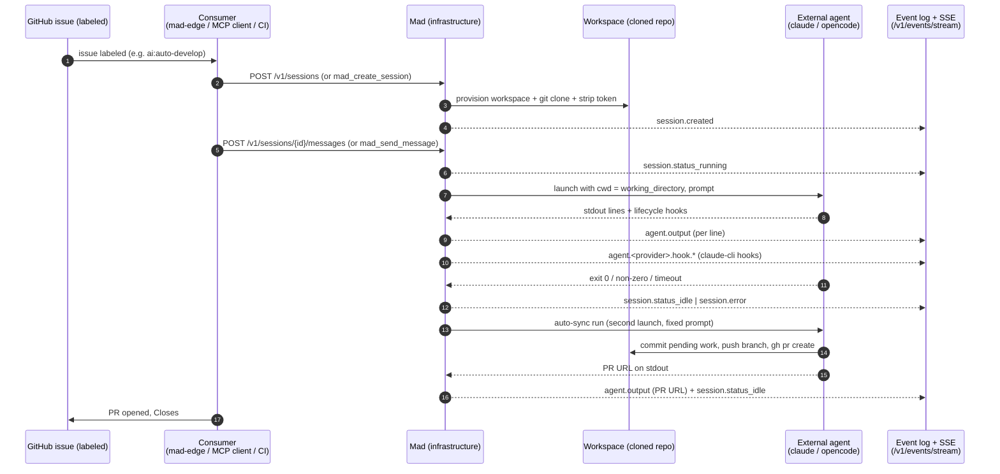

# Flow Participation

> Mad's seat in each end-to-end flow it participates in (e.g. issue -> session -> agent run -> events -> PR): inputs, outputs, ordering. One file per flow.

This section documents where **Mad** sits inside larger, often cross-service flows.
Mad is the **infrastructure step** of these flows: it provisions an isolated
workspace, clones the target GitHub repository, launches an **external**
autonomous coding agent against it, streams the agent's stdout as `agent.output`
events, and reports completion. Mad does **not** decide what to build, parse the
agent's tool calls, or run an agent loop — that is the external agent's harness
(CLAUDE.md hard rule 1). Read each flow below for what comes before and after
Mad's seat, and exactly which inputs and outputs Mad owns.

One file per flow. Today there is a single canonical flow (issue -> PR); add a
new file to this directory for each additional flow as it is wired up, and link
it from the list at the end.

## Canonical flow: GitHub issue -> session -> agent run -> events -> PR

A consumer (the `mad-edge` package, an MCP client, or a CI workflow) reacts to a
labeled GitHub issue, calls Mad to create a session, and Mad drives the agent run
to a pull request. Mad's seat is the **session lifecycle** — everything between
"create session" and "auto-sync opens the PR".

### Mad's seat: inputs, outputs, ordering

**Inputs (what flows into Mad)**

- A **create-session request** over HTTP (`POST /v1/sessions`) or the mirrored
  MCP tool (`mad_create_session`), carrying the agent spec (`name`, `provider`),
  the resources to mount (`github_repository` with a clone URL and a short-lived
  `authorization_token`; optionally inline `file` resources), and run knobs
  (`base_branch`, `working_directory`, `model`, `effort`, `timeout_s`,
  `idempotency_key`).
- A **prompt** delivered via `POST /v1/sessions/{id}/messages` (or
  `mad_send_message`) that becomes the agent's first run.

**What Mad does, in order**

1. Validate every `mount_path` (and `working_directory`) against path traversal
   before any I/O (hard rule 3), then provision the session workspace.
2. Clone each `github_repository` resource, then strip the token from the remote
   with `git remote set-url` so it is never persisted (hard rule 2). Emit
   `session.created`.
3. Resolve the agent's working directory: explicit `working_directory` wins,
   else auto-derive from a single GitHub mount, else the workspace root
   (ADR-0011).
4. On the first message, emit `session.status_running` and launch the external
   agent with `cwd = working_directory`, streaming each stdout line as an
   `agent.output` event. The claude-cli launcher also forwards lifecycle hooks
   as `agent.<provider>.hook.*` events over the internal UDS adapter (ADR-0008).
5. On the agent's exit, emit `session.status_idle` (exit 0) or `session.error`
   (non-zero / timeout, with scrubbed stderr).
6. **Auto-sync**: always launch a second run with the fixed auto-sync prompt
   (`build_auto_sync_prompt`). The agent inspects git state, and if there is
   pending work it branches off `base_branch` as `mad/<session_id>`, commits
   (always excluding `.claude/settings.local.json` and `.claude/settings.json`),
   pushes, and opens a PR with `gh pr create`. Mad only orchestrates "always run
   this second prompt at the end" — the commit/branch/PR decisions live entirely
   in the prompt (hard rule 1).

**Outputs (what flows out of Mad)**

- An ordered **event stream** on the per-session JSONL log (the source of truth,
  hard rule 6), replayed verbatim over `GET /v1/events` and
  `GET /v1/events/stream`: `session.created` -> `session.status_running` ->
  `agent.output` (+ `agent.<provider>.hook.*`) -> `session.status_idle` /
  `session.error`, then the auto-sync run's events ending with the **PR URL**
  printed as an `agent.output` line.
- The **pull request** itself, opened by the agent during auto-sync against
  `base_branch` and typically closing the originating issue.

**What is outside Mad's seat**

- Selecting and labeling the issue, and the decision to start a run — the
  consumer's job. As a reference, `.github/workflows/ai-develop-on-issue.yml`
  shows a GitHub-native variant that drives `claude-code-action` directly
  (gated by an author allowlist + the `ai:auto-develop` label) rather than
  through Mad's session API; Mad's seat is the equivalent self-hosted path.
- What the agent actually writes, which tools it runs, and how it reasons — the
  external agent's harness owns all of it (hard rule 1).

## Flows

| Flow | Trigger | Mad's seat | File |
|---|---|---|---|
| Issue -> PR (canonical) | Labeled GitHub issue picked up by a consumer | Create session, clone + provision, launch agent, stream events, auto-sync the PR | this file |

Additional flows (for example: scheduled / recurring runs, multi-repo sessions,
or a follow-up message resuming a conversation) should each get their own file in
this directory and a row in the table above.
