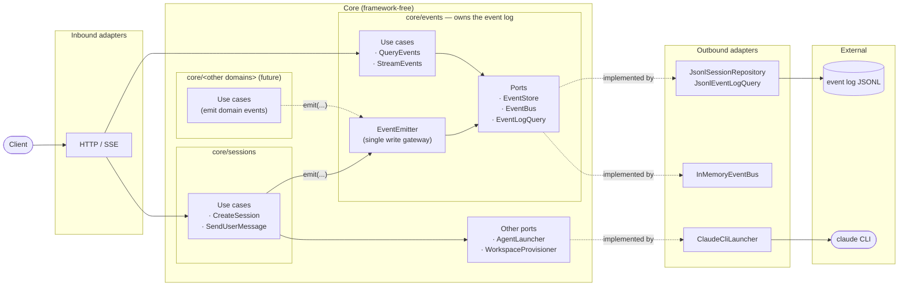

# Events Architecture

## How responsibilities are split

- **`core/events` owns the event log.** It defines the ports (`EventStore`, `EventBus`, `EventLogQuery`), exposes `EventEmitter` as the single write path, and provides the read-side use cases (`QueryEvents`, `StreamEvents`). Nothing outside this module persists or publishes events directly.
- **Other domains (`core/sessions`, future ones) are producers.** They receive `EventEmitter` as an injected dependency and call `emit(session_id, type, data)` when something domain-relevant happens. They do not know about `EventStore` or `EventBus`.
- **The log is cross-cutting.** An event produced by `core/sessions` and an event produced by a future domain land in the same JSONL and are consumed by the same `QueryEvents` / `StreamEvents`.

## Hexagonal layers

- **Inbound** — FastAPI routes. Parse HTTP, call use cases, serialize the response.
- **Core** — domain + use cases + ports, no FastAPI or `subprocess` (hard rule 4). Split into bounded contexts: `events` (cross-cutting) and the producer domains.
- **Outbound** — concrete implementations. JSONL on disk, in-memory bus, launcher that spawns `claude`.
- **External** — the on-disk log (source of truth, hard rule 6) and external processes.

## Key rules

- **Hard rule 9** — every write to the event log goes through `EventEmitter.emit()`. It is the boundary between producer domains and `core/events`.
- **Hard rule 6** — the JSONL is authoritative. `EventEmitter` persists before publishing.
- **Hard rule 2** — token redaction lives in an `emit()` wrapper the producer domain builds before handing it to an outbound adapter (e.g. the launcher).

## Flows

- **Write** — a producer domain calls `emitter.emit(...)` → `core/events` persists via `EventStore` and publishes via `EventBus`.
- **Historical read** — `GET /v1/events` → `QueryEvents` → `EventLogQuery` → JSONL.
- **Live tail** — `GET /v1/events/stream` → `StreamEvents` subscribes to `EventBus` and, if `Last-Event-ID` is present, replays from `EventLogQuery` with `event_id`-based dedup (ADR-0004 / ADR-0005).
